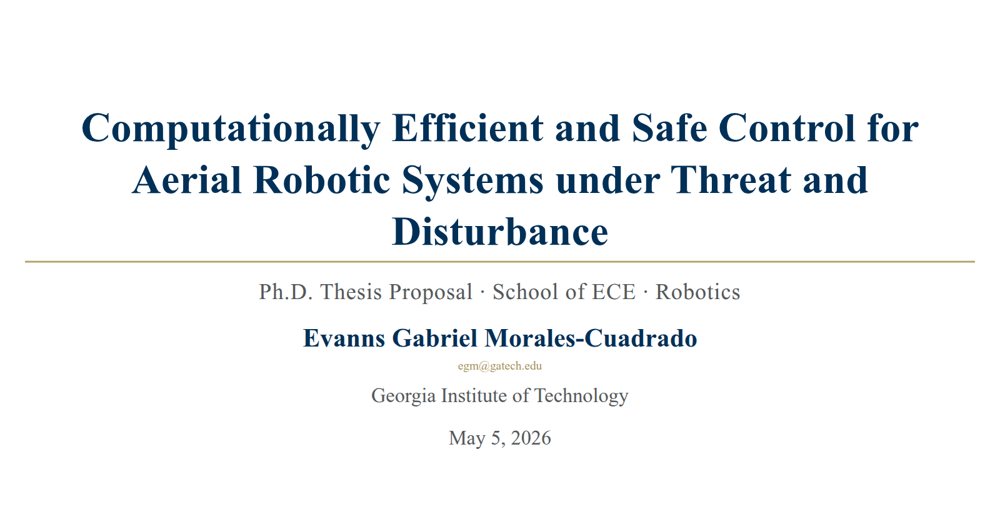

```{=html}
<style>
#title-block-header {
  display: none;
}

/* Wider layout for 2-column projects */
.page-columns {
  grid-template-columns: [screen-start] 5rem [screen-start-inset] 0 [page-start] 0 [page-start-inset] 0 [body-start-outset] 0 [body-start] 0 [body-content-start] 1fr [body-content-end] 0 [body-end] 0 [body-end-outset] 0 [page-end-inset] 0 [page-end] 0 [screen-end-inset] 5rem [screen-end] !important;
}

main.content.column-page {
  padding-left: 0 !important;
  padding-right: 0 !important;
}

/* Shared tokens from styles.css: --accent, --text-secondary
   Projects page overrides bg and border with custom values */
:root {
  --projects-bg-secondary: #e8eef8;
  --projects-border: #a8a4a0;
}

body.quarto-dark {
  --projects-bg-secondary: rgba(31, 41, 55, 0.92);
  --projects-border: rgba(148, 163, 184, 0.28);
}

.projects-shell {
  max-width: 100%;
  margin: 0 auto;
  padding: 3rem 1.25rem 5rem;
}

.projects-page-title {
  margin: 0 0 2rem;
  font-size: clamp(2rem, 3.6vw, 3rem);
  font-weight: 700;
  line-height: 1.05;
}

.projects-subtitle {
  margin: 0 0 1.5rem;
  font-size: 0.95rem;
  color: rgba(37, 99, 235, 0.7);
  letter-spacing: 0.1em;
  text-transform: uppercase;
}

.projects-columns {
  display: grid;
  grid-template-columns: 1fr 1fr;
  gap: 2.5rem;
  align-items: start;
}

/* ───── Filter strip (matches blog + tech-zone) ───── */
.projects-filter-strip {
  display: flex;
  align-items: center;
  gap: 0.85rem;
  margin: 0 0 1.8rem;
  flex-wrap: wrap;
}

.projects-filter-input {
  flex: 1 1 22rem;
  min-width: 14rem;
  max-width: 32rem;
  padding: 0.55rem 0.85rem 0.55rem 2.2rem;
  border: 1.5px solid var(--projects-border);
  border-radius: 0.7rem;
  background:
    var(--bs-body-bg, #fff)
    url("data:image/svg+xml;utf8,<svg xmlns='http://www.w3.org/2000/svg' viewBox='0 0 24 24' fill='none' stroke='%2394a3b8' stroke-width='2' stroke-linecap='round' stroke-linejoin='round'><circle cx='11' cy='11' r='7'/><line x1='21' y1='21' x2='16.65' y2='16.65'/></svg>") no-repeat 0.65rem center / 1rem 1rem;
  font-family: ui-monospace, SFMono-Regular, Menlo, Consolas, monospace;
  font-size: 0.9rem;
  color: inherit;
  transition: border-color 0.18s ease, box-shadow 0.18s ease;
}

.projects-filter-input:focus {
  outline: none;
  border-color: var(--accent);
  box-shadow: 0 0 0 3px color-mix(in srgb, var(--accent) 22%, transparent);
}

.projects-filter-count {
  font-family: ui-monospace, SFMono-Regular, Menlo, Consolas, monospace;
  font-size: 0.78rem;
  color: var(--text-secondary);
  letter-spacing: 0.04em;
}
.projects-filter-count strong { color: var(--accent); font-weight: 700; }

.project-card[hidden] { display: none; }

/* Hide an entire column when all its cards are filtered out
   (gracefully handled by the JS toggling [data-empty]). */
.projects-columns > div[data-empty="true"] { display: none; }

.projects-column-heading {
  margin: 0 0 0.45rem;
  font-size: 0.75rem;
  font-weight: 700;
  text-transform: uppercase;
  letter-spacing: 0.12em;
  color: var(--accent);
}

.projects-column-title {
  margin: 0 0 0.5rem;
  font-size: 1.3rem;
  font-weight: 700;
  line-height: 1.15;
}

.projects-column-intro {
  margin: 0 0 1.4rem;
  color: var(--text-secondary);
  font-size: 0.95rem;
  line-height: 1.7;
}

.project-stack {
  display: grid;
  gap: 1rem;
}

.project-card {
  border: 1.5px solid var(--projects-border);
  border-radius: 1.35rem;
  background: var(--projects-bg-secondary);
  overflow: hidden;
  transition: border-color 0.2s ease, box-shadow 0.2s ease;
}

.project-card:hover {
  border-color: color-mix(in srgb, var(--accent) 28%, var(--projects-border));
  box-shadow: 0 4px 16px rgba(0, 0, 0, 0.06);
}

.project-card summary {
  list-style: none;
  cursor: pointer;
}

.project-card summary::-webkit-details-marker {
  display: none;
}

.project-summary {
  display: grid;
  grid-template-columns: 1fr;
  gap: 1rem;
  padding: 1.55rem;
}

.project-summary,
.project-body {
  cursor: pointer;
}

.project-copy {
  min-width: 0;
}

.project-tags {
  display: flex;
  flex-wrap: wrap;
  gap: 0.55rem;
  margin-bottom: 0.8rem;
}

.project-tag {
  padding: 0.32rem 0.7rem;
  border-radius: 999px;
  border: 1.5px solid var(--projects-border);
  color: var(--text-secondary);
  font-size: 0.78rem;
  font-weight: 600;
  background: var(--bs-body-bg, #fff);
}

.project-name-row {
  display: flex;
  align-items: center;
  justify-content: space-between;
  gap: 1rem;
  margin-bottom: 0.6rem;
}

.project-name-group {
  display: flex;
  align-items: center;
  gap: 0.75rem;
  min-width: 0;
}

.project-number {
  display: inline-flex;
  align-items: center;
  justify-content: center;
  width: 2rem;
  height: 2rem;
  border-radius: 999px;
  background: rgba(37, 99, 235, 0.1);
  color: var(--accent);
  font-size: 0.82rem;
  font-weight: 800;
  letter-spacing: 0.04em;
  flex-shrink: 0;
}

.project-name {
  margin: 0;
  font-size: 1.28rem;
  font-weight: 700;
}

body.quarto-dark .project-name {
  color: #fff;
}

.project-toggle {
  display: inline-flex;
  align-items: center;
  justify-content: center;
  padding: 0.42rem 0.82rem;
  border: 1.5px solid var(--projects-border);
  border-radius: 999px;
  background: var(--bs-body-bg, #fff);
  color: var(--accent);
  font-size: 0.78rem;
  font-weight: 700;
  letter-spacing: 0.03em;
  white-space: nowrap;
  box-shadow: 0 0.4rem 1rem rgba(15, 23, 42, 0.06);
  cursor: pointer;
  transition: border-color 0.18s ease, background-color 0.18s ease, color 0.18s ease, transform 0.18s ease;
}

.project-toggle:hover,
.project-toggle:focus-visible {
  border-color: var(--accent);
  background: rgba(37, 99, 235, 0.08);
  color: var(--accent);
  transform: translateY(-1px);
}

.project-toggle:focus-visible {
  outline: 2px solid color-mix(in srgb, var(--accent) 45%, transparent);
  outline-offset: 0.12rem;
}

.project-card[open] .project-toggle::before {
  content: "Hide details";
}

.project-card:not([open]) .project-toggle::before {
  content: "Expand";
}

.project-preview-copy {
  margin: 0;
  color: var(--text-secondary);
  font-size: 0.96rem;
  line-height: 1.72;
}

.project-cta-hint {
  margin: 0.8rem 0 0;
  color: var(--text-secondary);
  font-size: 0.78rem;
  letter-spacing: 0.04em;
  text-transform: uppercase;
  opacity: 0;
  max-height: 0;
  overflow: hidden;
  transition: opacity 0.25s ease, max-height 0.25s ease;
}

.project-card:hover .project-cta-hint,
.project-card:focus-within .project-cta-hint {
  opacity: 1;
  max-height: 2rem;
}

.project-preview-panel {
  display: flex;
  align-items: stretch;
  min-height: 12rem;
  border: 1.5px solid var(--projects-border);
  border-radius: 1rem;
  background: var(--bs-body-bg, #fff);
  overflow: hidden;
}

.project-preview-panel img {
  width: 100%;
  height: 100%;
  object-fit: cover;
  display: block;
}

.project-preview-panel.rtd-preview img {
  width: 105.5%;
  height: 100%;
  max-width: none;
  object-fit: cover;
  object-position: left center;
  background: var(--bs-body-bg, #fff);
}

.project-preview-panel.rtd-preview {
  min-height: 0;
  aspect-ratio: 1.4 / 1;
}

/* Looping hardware-footage previews (NMPC, NR Flow, MoCap). Clips are
   encoded at 860x620 to match the RTD-RAX gif exactly, so every card
   preview on the page shares one aspect ratio and the top row of the
   two columns lines up. */
.project-preview-panel video {
  width: 100%;
  height: 100%;
  object-fit: cover;
  display: block;
}

.project-preview-panel.clip-preview {
  min-height: 0;
  aspect-ratio: 1.4 / 1;
}

/* Keep the video previews at thumbnail scale — full-bleed footage reads as a
   hero image and overwhelms the card copy. Deliberately scoped to .clip-preview
   only: the rtd-rax gif stays full width, since it is a simulation plot whose
   axis labels and annotations lose legibility when scaled down. */
.project-preview-panel.clip-preview {
  max-width: 66%;
  margin-inline: auto;
}

/* Slide screenshots are 16:9, not the 1.4:1 the clips use, so they get their
   own panel rather than being cropped by object-fit. */
.project-preview-panel.slide-preview {
  min-height: 0;
  aspect-ratio: 16 / 9;
  max-width: 66%;
  margin-inline: auto;
}

@media (max-width: 1100px) {
  /* Single-column layout already narrows the cards — don't shrink twice. */
  .project-preview-panel.clip-preview,
  .project-preview-panel.slide-preview {
    max-width: 82%;
  }
}

.project-preview-custom {
  width: 100%;
  padding: 1.15rem;
  display: flex;
  flex-direction: column;
  justify-content: space-between;
  gap: 1rem;
  background:
    radial-gradient(circle at top right, rgba(37, 99, 235, 0.12), transparent 35%),
    linear-gradient(180deg, rgba(59, 130, 246, 0.08), rgba(59, 130, 246, 0.02));
}

body.quarto-dark .project-preview-custom {
  background:
    radial-gradient(circle at top right, rgba(59, 130, 246, 0.18), transparent 38%),
    linear-gradient(180deg, rgba(30, 41, 59, 0.96), rgba(15, 23, 42, 0.96));
}

.project-preview-title {
  margin: 0;
  font-size: 0.84rem;
  font-weight: 700;
  letter-spacing: 0.06em;
  text-transform: uppercase;
  color: var(--accent);
}

.project-preview-lines {
  display: grid;
  gap: 0.45rem;
}

.project-preview-line {
  padding: 0.55rem 0.7rem;
  border-radius: 0.8rem;
  background: rgba(255, 255, 255, 0.92);
  color: var(--text-secondary);
  font-size: 0.87rem;
  font-weight: 600;
}

body.quarto-dark .project-preview-line {
  background: rgba(15, 23, 42, 0.72);
  color: var(--bs-body-color);
}

.project-preview-metrics {
  display: flex;
  flex-wrap: wrap;
  gap: 0.6rem;
}

.project-preview-metric {
  padding: 0.45rem 0.7rem;
  border-radius: 0.8rem;
  background: rgba(37, 99, 235, 0.08);
  color: var(--accent);
  font-size: 0.8rem;
  font-weight: 700;
}

body.quarto-dark .project-preview-metric,
body.quarto-dark .project-number {
  background: rgba(59, 130, 246, 0.18);
}

body.quarto-dark .project-toggle {
  background: rgba(15, 23, 42, 0.78);
  box-shadow: none;
}

.project-actions {
  cursor: auto;
}

.project-actions a {
  cursor: pointer;
}

.project-body {
  padding: 0 1.55rem 1.55rem;
  border-top: 1.5px solid var(--projects-border);
}

.project-body-grid {
  display: grid;
  grid-template-columns: 1fr;
  gap: 1.25rem;
  padding-top: 1.2rem;
}

.project-detail-copy {
  color: var(--text-secondary);
  font-size: 0.95rem;
  line-height: 1.72;
}

.project-detail-copy p {
  margin: 0 0 0.9rem;
}

.project-detail-copy p:last-child {
  margin-bottom: 0;
}

.project-detail-list {
  margin: 0;
  padding-left: 1.15rem;
  color: var(--text-secondary);
}

.project-detail-list li + li {
  margin-top: 0.45rem;
}

.project-actions {
  display: flex;
  flex-wrap: wrap;
  gap: 0.75rem;
  align-content: flex-start;
}

.project-action {
  display: inline-flex;
  align-items: center;
  justify-content: center;
  padding: 0.8rem 1rem;
  border-radius: 0.9rem;
  border: 1.5px solid var(--projects-border);
  text-decoration: none;
  font-weight: 600;
  background: var(--bs-body-bg, #fff);
}

.project-action.primary {
  background: var(--accent);
  border-color: var(--accent);
  color: #fff;
}

.project-action.primary:hover,
.project-action.primary:focus {
  color: #fff;
  opacity: 0.92;
}

.project-action.secondary {
  background: #c2410c;
  border-color: #c2410c;
  color: #fff;
  font-weight: 700;
}

.project-action.secondary:hover,
.project-action.secondary:focus {
  background: #9a3412;
  border-color: #9a3412;
  color: #fff;
}

.project-action.paper {
  background: rgba(37, 99, 235, 0.1);
  border-color: rgba(37, 99, 235, 0.2);
  color: #1e40af;
  font-weight: 600;
  font-size: 0.88em;
}

.project-action.paper:hover,
.project-action.paper:focus {
  background: rgba(37, 99, 235, 0.18);
  border-color: rgba(37, 99, 235, 0.35);
  color: #1e3a8a;
}

body.quarto-dark .project-action.paper {
  background: rgba(96, 165, 250, 0.15);
  border-color: rgba(96, 165, 250, 0.25);
  color: #93c5fd;
  font-weight: 600;
}

body.quarto-dark .project-action.paper:hover,
body.quarto-dark .project-action.paper:focus {
  background: rgba(96, 165, 250, 0.25);
  border-color: rgba(96, 165, 250, 0.4);
  color: #bfdbfe;
}

@media (max-width: 1100px) {
  .projects-columns {
    grid-template-columns: 1fr;
  }
}

@media (max-width: 640px) {
  .page-columns {
    grid-template-columns: [screen-start] 0.45rem [screen-start-inset] 0 [page-start] 0 [page-start-inset] 0 [body-start-outset] 0 [body-start] 0 [body-content-start] 1fr [body-content-end] 0 [body-end] 0 [body-end-outset] 0 [page-end-inset] 0 [page-end] 0 [screen-end-inset] 0.45rem [screen-end] !important;
  }

  #quarto-document-content {
    padding-left: 0 !important;
    padding-right: 0 !important;
  }

  .projects-shell {
    padding: 2.5rem 0.55rem 4rem;
  }

  .project-summary {
    padding: 1.25rem;
  }

  .project-body {
    padding: 0 1.25rem 1.25rem;
  }

  .project-name-row {
    flex-direction: column;
    align-items: flex-start;
  }
}
</style>

<div class="projects-shell">
  <p class="projects-page-title">Research & Open-Source Builds.</p>
  <p class="projects-subtitle">Click on a Panel to See the Full Project Page.</p>

  <!-- ───── Filter strip ───── -->
  <div class="projects-filter-strip">
    <input
      class="projects-filter-input"
      type="search"
      placeholder="filter by title, topic, or #tag…"
      aria-label="Filter projects"
      autocomplete="off"
    />
    <span class="projects-filter-count" aria-live="polite">
      showing <strong id="projects-count-shown">8</strong> of <strong id="projects-count-total">8</strong>
    </span>
  </div>

  <div class="projects-columns" id="projects-columns">
    <!-- LEFT COLUMN: Research Projects -->
    <div data-col="research">
      <p class="projects-column-heading">Research Projects</p>
      <p class="projects-column-title">Projects from my Ph.D. Research with Accompanying Code.</p>
      <p class="projects-column-intro">
        Research projects in safe autonomous control for unmanned aerial and ground vehicles.
      </p>

      <div class="project-stack">
        <details class="project-card" data-project-href="../projects/rtd-rax/" open>
          <summary>
            <div class="project-summary">
              <div class="project-copy">
                <div class="project-tags">
                  <span class="project-tag">Real-Time Planning</span>
                  <span class="project-tag">Disturbance Handling</span>
                  <span class="project-tag">Reachability Analysis</span>
                  <!-- <span class="project-tag">Robotics</span>
                  <span class="project-tag">Safety</span>
                  <span class="project-tag">Research</span> -->
                </div>
                <div class="project-name-row">
                  <div class="project-name-group">
                    <span class="project-number">01</span>
                    <p class="project-name">RTD-RAX</p>
                  </div>
                  <button class="project-toggle" type="button" aria-label="Hide or show details"></button>
                </div>
                <p class="project-preview-copy">
                  Runtime-assurance trajectory planning for quadrotors, with online reachability verification and repair instead of overly conservative offline safety buffers.
                </p>
                <p class="project-cta-hint">Tap anywhere on this panel to open the project page.</p>
              </div>
              <div class="project-preview-panel rtd-preview">
                
              </div>
            </div>
          </summary>
          <div class="project-body">
            <div class="project-body-grid">
              <div class="project-detail-copy">
                <p>
                  RTD-RAX extends Reachability-based Trajectory Design by separating fast candidate generation from online safety certification. The planner stays agile, while a verifier certifies each trajectory under the actual measured conditions and repairs unsafe candidates before execution.
                </p>
                <ul class="project-detail-list">
                  <li>Mixed-monotone reachability verification at runtime via <code>immrax</code>.</li>
                  <li>Hybrid repair loop when a candidate cannot be certified safe.</li>
                  <li>Three case studies with manuscript-ready figure generation and Dockerized reproducibility.</li>
                </ul>
              </div>
              <div class="project-actions">
                <a class="project-action primary" href="../projects/rtd-rax/">Open Project Page</a>
                <a class="project-action secondary" href="https://evannsmc.github.io/ws_RTD" target="_blank">Official RTD-RAX Website ↗</a>
              </div>
              <div class="project-actions">
                <a class="project-action paper" href="https://arxiv.org/abs/2603.21635" target="_blank">MECC-ALDSC Paper (Preprint PDF) ↗</a>
                <a class="project-action" href="https://github.com/evannsmc/rtd-rax" target="_blank">GitHub ↗</a>
              </div>
            </div>
          </div>
        </details>

        <details class="project-card" data-project-href="../projects/nmpc-acados/" open>
          <summary>
            <div class="project-summary">
              <div class="project-copy">
                <div class="project-tags">
                  <span class="project-tag">Acados</span>
                  <span class="project-tag">Casadi</span>
                  <span class="project-tag">Python</span>
                  <!-- <span class="project-tag">ROS2</span> -->
                </div>
                <div class="project-name-row">
                  <div class="project-name-group">
                    <span class="project-number">02</span>
                    <p class="project-name">NMPC for Quadrotors</p>
                  </div>
                  <button class="project-toggle" type="button" aria-label="Hide or show details"></button>
                </div>
                <p class="project-preview-copy">
                  A clean NMPC baseline for quadrotor research built around Acados and QPOASES, with a full ROS 2 interface and real-time-ready generated code.
                </p>
                <p class="project-cta-hint">Tap anywhere on this panel to open the project page.</p>
              </div>
              <div class="project-preview-panel clip-preview">
                <video src="../projects/nr-flow/nr_loop.mp4"
                       autoplay muted loop playsinline preload="metadata"
                       aria-label="Quadrotor tracking flight in Georgia Tech's Indoor Flight Lab"></video>
              </div>
            </div>
          </summary>
          <div class="project-body">
            <div class="project-body-grid">
              <div class="project-detail-copy">
                <p>
                  This controller served as the main comparison baseline for the Newton-Raphson Flow work. It is a solid reference implementation if you want a rigorous NMPC starting point rather than a highly specialized demo.
                </p>
                <ul class="project-detail-list">
                  <li>Jointly tracks position, velocity, and Euler angles.</li>
                  <li>Handles wrapped yaw error correctly.</li>
                  <li>Uses hard thrust and body-rate constraints with a clean command-line interface.</li>
                </ul>
              </div>
              <div class="project-actions">
                <a class="project-action primary" href="../projects/nmpc-acados/">Open Project Page</a>
                <a class="project-action paper" href="https://arxiv.org/abs/2508.14185" target="_blank">TCST 2025 Paper (PDF) ↗</a>
                <a class="project-action" href="https://www.youtube.com/watch?v=kNnP4_LbdNk" target="_blank">Hardware Experiments Video ↗</a>
              </div>
              <div class="project-actions">
                <a class="project-action" href="https://github.com/evannsmc/nmpc_acados_px4" target="_blank">Python Version ↗</a>
                <a class="project-action" href="https://github.com/evannsmc/nmpc_acados_px4_cpp" target="_blank">C++ Version ↗</a>
              </div>
            </div>
          </div>
        </details>

        <details class="project-card" data-project-href="../projects/nahs/" open>
          <summary>
            <div class="project-summary">
              <div class="project-copy">
                <div class="project-tags">
                  <span class="project-tag">Safety</span>
                  <span class="project-tag">Formal Methods</span>
                  <span class="project-tag">Hybrid Systems</span>
                  <!-- <span class="project-tag">ROS 2</span> -->
                  <!-- <span class="project-tag">Research</span> -->
                </div>
                <div class="project-name-row">
                  <div class="project-name-group">
                    <span class="project-number">03</span>
                    <p class="project-name">Interval STL Runtime Assurance</p>
                  </div>
                  <button class="project-toggle" type="button" aria-label="Hide or show details"></button>
                </div>
                <p class="project-preview-copy">
                  Safe control from signal temporal logic safety specifications for linear systems with bounded uncertainty, using interval STL and runtime assurance with real-time MILP-based correction.
                </p>
                <p class="project-cta-hint">Tap anywhere on this panel to open the project page.</p>
              </div>
              <div class="project-preview-panel clip-preview">
                <video src="../projects/nahs/istl_loop.mp4"
                       autoplay muted loop playsinline preload="metadata"
                       aria-label="Miniature autonomous blimp flying above the marked specification region during an interval STL runtime-assurance run"></video>
              </div>
            </div>
          </summary>
          <div class="project-body">
            <div class="project-body-grid">
              <div class="project-detail-copy">
                <p>
                  This project addresses safe control from signal temporal logic safety specifications for linear systems with bounded uncertainty in a static environment. A runtime-assurance layer evaluates the nominal controller's proposed input at each update step and minimally adjusts it whenever needed to maintain specification satisfaction under all realizations of the uncertainty.
                </p>
                <ul class="project-detail-list">
                  <li>Leverages interval signal temporal logic so uncertainty can be handled directly with only a modest program-size increase.</li>
                  <li>Solves a mixed-integer linear program at each controller update step and includes conditions that guarantee long-horizon feasibility.</li>
                  <li>Ensures a safe backup input is always available if a computation deadline is ever missed, and demonstrates real-time tractability on a miniature autonomous blimp.</li>
                </ul>
              </div>
              <div class="project-actions">
                <a class="project-action primary" href="../projects/nahs/">Open Project Page</a>
                <a class="project-action paper" href="https://papers.ssrn.com/sol3/Delivery.cfm?abstractid=6168587" target="_blank">NAHS 2025 Paper (Preprint PDF) ↗</a>
                <a class="project-action" href="https://www.youtube.com/watch?v=NnzkQqTfHIM" target="_blank">Blimp Demo Video ↗</a>
              </div>
            </div>
          </div>
        </details>

        <details class="project-card" data-project-href="../projects/nr-flow/" open>
          <summary>
            <div class="project-summary">
              <div class="project-copy">
                <div class="project-tags">
                  <span class="project-tag">Continuous-time Newton Raphson</span>
                  <span class="project-tag">JAX Implementation</span>
                  <span class="project-tag">Computational Efficiency</span>
                  <!-- <span class="project-tag">ROS2</span> -->
                </div>
                <div class="project-name-row">
                  <div class="project-name-group">
                    <span class="project-number">04</span>
                    <p class="project-name">Newton-Raphson Flow Control: Fast, Efficient, & Modular Control Algorithm</p>
                  </div>
                  <button class="project-toggle" type="button" aria-label="Hide or show details"></button>
                </div>
                <p class="project-preview-copy">
                  A research-grade quadrotor controller that reframes tracking as a continuous-time Newton-Raphson problem and runs on real onboard hardware.
                </p>
                <p class="project-cta-hint">Tap anywhere on this panel to open the project page.</p>
              </div>
              <div class="project-preview-panel clip-preview">
                <video src="../projects/mocap4px4/mocap_loop.mp4"
                       autoplay muted loop playsinline preload="metadata"
                       aria-label="Overhead view of a quadrotor tracking a trajectory inside the flight volume"></video>
              </div>
            </div>
          </summary>
          <div class="project-body">
            <div class="project-body-grid">
              <div class="project-detail-copy">
                <p>
                  NR Flow uses a continuous-time version of the traditional Newton-Raphson algorithm and poses it as a tracking controller. It is fast, computationally lightweight, and easily deployable on different kinds of systems with very little tuning or overhead required. Most importantly, it provides accurate tracking control even in comparison to powerful controllers such as NMPC. We utilize integral control barrier functions (I-CBFs) to smoothly enforce actuator limits.
                </p>
                <ul class="project-detail-list">
                  <li>Runs comfortably on a Raspberry Pi 4 onboard a quadrotor.</li>
                  <li>Supports both simulation and hardware workflows.</li>
                  <li>Backed by multiple peer-reviewed papers rather than a one-off demo implementation.</li>
                </ul>
              </div>
              <div class="project-actions">
                <a class="project-action primary" href="../projects/nr-flow/">Open Project Page</a>
                <a class="project-action paper" href="https://arxiv.org/abs/2408.11197" target="_blank">ACC 2024 Paper (PDF) ↗</a>
                <a class="project-action paper" href="https://arxiv.org/abs/2508.14185" target="_blank">TCST 2025 Paper (PDF) ↗</a>
                <a class="project-action" href="https://www.youtube.com/watch?v=kNnP4_LbdNk" target="_blank">Hardware Experiments Video ↗</a>
                <a class="project-action" href="https://github.com/evannsmc/newton_raphson_px4" target="_blank">Python Version ↗</a>
                <a class="project-action" href="https://github.com/evannsmc/newton_raphson_px4_cpp" target="_blank">C++ Version ↗</a>
              </div>
            </div>
          </div>
        </details>
      </div>
    </div>

    <!-- RIGHT COLUMN: Independent Projects -->
    <div data-col="independent">
      <p class="projects-column-heading">Independent Projects</p>
      <p class="projects-column-title">Open-source tools and infrastructure.</p>
      <p class="projects-column-intro">
        Standalone codebases, utilities, and templates that grew out of day-to-day research needs.
      </p>

      <div class="project-stack">
        <details class="project-card" data-project-href="../projects/mocap4px4/" open>
          <summary>
            <div class="project-summary">
              <div class="project-copy">
                <div class="project-tags">
                  <span class="project-tag">ROS 2</span>
                  <span class="project-tag">C++</span>
                  <span class="project-tag">Motion Capture</span>
                  <span class="project-tag">PX4</span>
                </div>
                <div class="project-name-row">
                  <div class="project-name-group">
                    <span class="project-number">01</span>
                    <p class="project-name">MoCap4ROS2 Packages</p>
                  </div>
                  <button class="project-toggle" type="button" aria-label="Hide or show details"></button>
                </div>
                <p class="project-preview-copy">
                  My ROS 2 C++ packages that bridge Vicon and OptiTrack motion-capture systems to the PX4 autopilot EKF for indoor quadrotor flight experiments. They handle coordinate conversion, quaternion reordering, timestamping, and full-state relay out of the box.
                </p>
                <p class="project-cta-hint">Tap anywhere on this panel to open the project page.</p>
              </div>
              <div class="project-preview-panel clip-preview">
                <video src="../projects/nr-flow/nr_loop.mp4"
                       autoplay muted loop playsinline preload="metadata"
                       aria-label="Quadrotor flying a tracked trajectory in Georgia Tech's Indoor Flight Lab"></video>
              </div>
            </div>
          </summary>
          <div class="project-body">
            <div class="project-body-grid">
              <div class="project-detail-copy">
                <p>
                  Running indoor flight experiments means solving the same infrastructure problem every time: getting motion-capture position data into the drone's state estimator reliably. Vicon4PX4 and OptiTrack4PX4 handle the entire pipeline — coordinate frame conversion, quaternion reordering, PX4 timestamping, and optional full-state merging — so you can focus on your controller, not the plumbing.
                </p>
                <ul class="project-detail-list">
                  <li>Vicon4PX4 connects via the DataStream SDK (vendored — no system install).
                  <li>OptiTrack4PX4 connects via NatNet (vendored — no system install).
                  <li>Both publish <code>VehicleOdometry</code> on <code>/fmu/in/vehicle_visual_odometry</code> for direct PX4 EKF external-vision fusion.</li>
                  <li>Adopted by Georgia Tech's Indoor Flight Lab as part of its official codebase.</li>
                </ul>
              </div>
              <div class="project-actions">
                <a class="project-action primary" href="../projects/mocap4px4/">Open Project Page</a>
                <a class="project-action secondary" href="https://gtae.gitbook.io/ifl/ifl-codebase/px4+ros2-vicon-receiver" target="_blank">GaTech IFL Codebase ↗</a>
              </div>
              <div class="project-actions">
                <a class="project-action" href="https://github.com/evannsmc/vicon4px4" target="_blank">Vicon4PX4 GitHub ↗</a>
                <a class="project-action" href="https://github.com/evannsmc/optitrack4px4" target="_blank">OptiTrack4PX4 GitHub ↗</a>
              </div>
            </div>
          </div>
        </details>

        <details class="project-card" data-project-href="../projects/quartocv/" open>
          <summary>
            <div class="project-summary">
              <div class="project-copy">
                <div class="project-tags">
                  <span class="project-tag">Quarto</span>
                  <span class="project-tag">LaTeX</span>
                  <span class="project-tag">Tools</span>
                </div>
                <div class="project-name-row">
                  <div class="project-name-group">
                    <span class="project-number">02</span>
                    <p class="project-name">QuartoCV</p>
                  </div>
                  <button class="project-toggle" type="button" aria-label="Hide or show details"></button>
                </div>
                <p class="project-preview-copy">
                  A Quarto-based joint CV-and-Resume build tool that updates shared sections once and propagates them across every output document automatically. Comes with docker/make infrastructure so you don't have to set anything up yourself or remember any commands. Just add new entries, update the content, and write 'make' on the command line and you're done!
                </p>
                <p class="project-cta-hint">Tap anywhere on this panel to open the project page.</p>
              </div>
              <div class="project-preview-panel">
                <div class="project-preview-custom">
                  <p class="project-preview-title">Build once, reuse everywhere</p>
                  <div class="project-preview-lines">
                    <div class="project-preview-line">Shared sections</div>
                    <div class="project-preview-line">Incremental PDF rebuilds</div>
                    <div class="project-preview-line">Academic + Industry Style Templates</div>
                  </div>
                  <div class="project-preview-metrics">
                    <span class="project-preview-metric">Quarto</span>
                    <span class="project-preview-metric">XeLaTeX</span>
                    <span class="project-preview-metric">Make</span>
                  </div>
                </div>
              </div>
            </div>
          </summary>
          <div class="project-body">
            <div class="project-body-grid">
              <div class="project-detail-copy">
                <p>
                  I made QuartoCV for my recurring problem of having to shift everything around on my Canva CV when I had a new entry to add, and then having to repeat my efforts multiple times for the shorter Resume version, and add/delete personal details for the public versions of these documents vs the private versions I give to recruiters.
                  
                  In QuartoCV, shared section files feed multiple outputs in a modular fashion so you edit one common source of truth, and all documents that highlight the information will be automatically updated. Moreover, my docker/make infrastructure allows you to rebuild documents when changes are made with a simple 'make' command, and to never have to download and set up any dependencies yourself. Check it out!  
                </p>
                <ul class="project-detail-list">
                  <li>One source section can feed multiple document variants.</li>
                  <li>Dependency-aware incremental builds keep edits fast.</li>
                  <li>Layouts are designed for both compact academic and cleaner standard resume styles.</li>
                </ul>
              </div>
              <div class="project-actions">
                <a class="project-action primary" href="../projects/quartocv/">Open Project Page</a>
                <a class="project-action" href="https://github.com/evannsmc/quartoCV" target="_blank">GitHub ↗</a>
              </div>
            </div>
          </div>
        </details>

        <details class="project-card" data-project-href="../projects/gatech-slides/" open>
          <summary>
            <div class="project-summary">
              <div class="project-copy">
                <div class="project-tags">
                  <span class="project-tag">Quarto</span>
                  <span class="project-tag">Tools</span>
                </div>
                <div class="project-name-row">
                  <div class="project-name-group">
                    <span class="project-number">03</span>
                    <p class="project-name">Quarto Georgia Tech Slide Template</p>
                  </div>
                  <button class="project-toggle" type="button" aria-label="Hide or show details"></button>
                </div>
                <p class="project-preview-copy">
                  A Georgia Tech-branded RevealJS presentation theme that installs into an existing Quarto project in one command. This is a fork of my labmate Brendan Gould's project with a whole set of custom features. Maybe one day we'll merge them :)
                </p>
                <p class="project-cta-hint">Tap anywhere on this panel to open the project page.</p>
              </div>
              <div class="project-preview-panel slide-preview">
                
              </div>
            </div>
          </summary>
          <div class="project-body">
            <div class="project-body-grid">
              <div class="project-detail-copy">
                <p>
                  This extension packages Georgia Tech colors, backgrounds, typography, and presentation utilities so branded slides can be spun up quickly in a normal Quarto workflow.
                </p>
                <ul class="project-detail-list">
                  <li>Built to be installed into an existing project with a single template command.</li>
                  <li>Includes branded title and section slide treatments.</li>
                  <li>Designed for presentations that still feel like Quarto, not a hard-coded slide deck.</li>
                </ul>
              </div>
              <div class="project-actions">
                <a class="project-action primary" href="../projects/gatech-slides/">Open Project Page</a>
                <a class="project-action" href="https://github.com/evannsmc/quarto-gatech-slides" target="_blank">GitHub ↗</a>
              </div>
            </div>
          </div>
        </details>

        <details class="project-card" data-project-href="../projects/homelab/" open>
          <summary>
            <div class="project-summary">
              <div class="project-copy">
                <div class="project-tags">
                  <span class="project-tag">Raspberry Pi</span>
                  <span class="project-tag">Tailscale</span>
                  <span class="project-tag">Self-Hosting</span>
                </div>
                <div class="project-name-row">
                  <div class="project-name-group">
                    <span class="project-number">04</span>
                    <p class="project-name">Beginner Homelab on a Raspberry Pi</p>
                  </div>
                  <button class="project-toggle" type="button" aria-label="Hide or show details"></button>
                </div>
                <p class="project-preview-copy">
                  A build-one-job-at-a-time guide to a private Raspberry Pi homelab: media streaming, network-wide ad blocking, pretty HTTPS URLs, a one-URL dashboard, phone access, and a VPN — all over a Tailscale mesh with no port forwarding and nothing exposed to the public internet.
                </p>
                <p class="project-cta-hint">Tap anywhere on this panel to open the project page.</p>
              </div>
              <div class="project-preview-panel">
                <div class="project-preview-custom">
                  <p class="project-preview-title">One Pi, one tailnet, nothing exposed</p>
                  <div class="project-preview-lines">
                    <div class="project-preview-line">Audiobookshelf + Pi-hole + Caddy + dashboard</div>
                    <div class="project-preview-line">Private over Tailscale, no port forwarding</div>
                    <div class="project-preview-line">An honest VPN-on-the-road chapter</div>
                  </div>
                  <div class="project-preview-metrics">
                    <span class="project-preview-metric">Raspberry Pi</span>
                    <span class="project-preview-metric">Tailscale</span>
                    <span class="project-preview-metric">Docker</span>
                  </div>
                </div>
              </div>
            </div>
          </summary>
          <div class="project-body">
            <div class="project-body-grid">
              <div class="project-detail-copy">
                <p>
                  A beginner-friendly homelab guide I wrote and tested on my own hardware. Each chapter does exactly one job and verifies it: a headless Pi on Tailscale, Audiobookshelf for media, Pi-hole for network-wide ad blocking, Caddy for real-HTTPS pretty URLs, a single <code>home.home</code> dashboard, phone remoting, and a VPN — all private by default, with secrets read from a git-ignored <code>.env</code> and nothing on the public internet.
                </p>
                <ul class="project-detail-list">
                  <li>Reached entirely over a Tailscale WireGuard mesh — no port forwarding, no dynamic DNS.</li>
                  <li>Manual commands first, with small auditable helper scripts beside them.</li>
                  <li>A Quarto source builds per-chapter READMEs, standalone PDFs, and a whole-book PDF.</li>
                  <li>An honest VPN chapter on why a privacy VPN and your homelab can't both be live at once — and what I actually run.</li>
                </ul>
              </div>
              <div class="project-actions">
                <a class="project-action primary" href="../projects/homelab/">Open Project Page</a>
                <a class="project-action" href="https://github.com/evannsmc/BeginnerHomelabGuide" target="_blank">GitHub ↗</a>
              </div>
            </div>
          </div>
        </details>
      </div>
    </div>
  </div>
</div>

<script>
document.addEventListener('DOMContentLoaded', function () {
  // ─── Live filter for the project grid ───
  var filterInput = document.querySelector('.projects-filter-input');
  var filterCount = document.getElementById('projects-count-shown');
  var columns     = document.getElementById('projects-columns');
  if (filterInput && filterCount && columns) {
    var filterables = Array.prototype.slice.call(
      columns.querySelectorAll('.project-card')
    );
    var colNodes = Array.prototype.slice.call(
      columns.querySelectorAll('[data-col]')
    );

    function applyProjectFilter() {
      var q = filterInput.value.trim().toLowerCase().replace(/^#/, '');
      var shown = 0;
      filterables.forEach(function (card) {
        if (!q) { card.hidden = false; shown++; return; }
        var title = (card.querySelector('.project-name') || {}).textContent || '';
        var tagEls = card.querySelectorAll('.project-tag');
        var tags = '';
        tagEls.forEach(function (t) { tags += ' ' + t.textContent; });
        var copy = (card.querySelector('.project-preview-copy') || {}).textContent || '';
        var hay = (title + ' ' + tags + ' ' + copy).toLowerCase();
        var match = hay.indexOf(q) !== -1;
        card.hidden = !match;
        if (match) shown++;
      });
      filterCount.textContent = String(shown);

      // Toggle empty-column visibility so we don't leave orphan headings.
      colNodes.forEach(function (col) {
        var anyVisible = Array.prototype.slice
          .call(col.querySelectorAll('.project-card'))
          .some(function (c) { return !c.hidden; });
        col.setAttribute('data-empty', anyVisible ? 'false' : 'true');
      });
    }

    filterInput.addEventListener('input', applyProjectFilter);
  }

  // ─── Existing card-as-link behavior ───
  var cards = document.querySelectorAll('.project-card[data-project-href]');

  cards.forEach(function (card) {
    var summary = card.querySelector('summary');
    var toggle = card.querySelector('.project-toggle');

    function syncToggleState() {
      if (!toggle) return;
      toggle.setAttribute('aria-expanded', String(card.open));
    }

    function goToProjectPage() {
      var href = card.getAttribute('data-project-href');
      if (href) window.location.href = href;
    }

    syncToggleState();

    if (toggle) {
      toggle.addEventListener('click', function (event) {
        event.preventDefault();
        event.stopPropagation();
        card.open = !card.open;
        syncToggleState();
      });
    }

    if (summary) {
      summary.addEventListener('click', function (event) {
        if (event.target.closest('.project-toggle')) return;
        event.preventDefault();
        goToProjectPage();
      });
    }

    card.addEventListener('click', function (event) {
      if (event.target.closest('summary')) return;
      if (event.target.closest('.project-toggle')) return;
      if (event.target.closest('a')) return;
      if (event.target.closest('button')) return;
      goToProjectPage();
    });
  });
});
</script>
```
